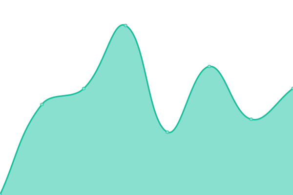

# [📈 Live Status](https://Trigone-Tech.github.io/upptime): <!--live status--> **🟧 Partial outage**

This repository contains the open-source uptime monitor and status page for [Trigone-Tech](https://Trigone-Tech.github.io/upptime), powered by [Upptime](https://github.com/upptime/upptime).

With [Upptime](https://upptime.js.org), you can get your own unlimited and free uptime monitor and status page, powered entirely by a GitHub repository. We use [Issues](https://github.com/Trigone-Tech/upptime/issues) as incident reports, [Actions](https://github.com/Trigone-Tech/upptime/actions) as uptime monitors, and [Pages](https://Trigone-Tech.github.io/upptime) for the status page.

<!--start: status pages-->
<!-- This summary is generated by Upptime (https://github.com/upptime/upptime) -->
<!-- Do not edit this manually, your changes will be overwritten -->
<!-- prettier-ignore -->
| URL | Status | History | Response Time | Uptime |
| --- | ------ | ------- | ------------- | ------ |
|  [Corporate](https://corporate.ayruu.com) | 🟩 Up | [corporate.yml](https://github.com/Trigone-Tech/upptime/commits/HEAD/history/corporate.yml) | 

 610ms
     
 | 

<a href="https://live.ayruu.com/history/corporate">97.56%</a>
    

|  [Office](https://office.ayruu.com) | 🟩 Up | [office.yml](https://github.com/Trigone-Tech/upptime/commits/HEAD/history/office.yml) | 

 554ms
     
 | 

<a href="https://live.ayruu.com/history/office">97.60%</a>
    

|  MyA | 🟥 Down | [my-a.yml](https://github.com/Trigone-Tech/upptime/commits/HEAD/history/my-a.yml) | 

 584ms
     
 | 

<a href="https://live.ayruu.com/history/my-a">100.00%</a>
    

|  Contract | 🟥 Down | [contract.yml](https://github.com/Trigone-Tech/upptime/commits/HEAD/history/contract.yml) | 

 527ms
     
 | 

<a href="https://live.ayruu.com/history/contract">100.00%</a>
    

|  Organization | 🟩 Up | [organization.yml](https://github.com/Trigone-Tech/upptime/commits/HEAD/history/organization.yml) | 

 2336ms
     
 | 

<a href="https://live.ayruu.com/history/organization">97.61%</a>
    

|  Engine | 🟩 Up | [engine.yml](https://github.com/Trigone-Tech/upptime/commits/HEAD/history/engine.yml) | 

 1059ms
     
 | 

<a href="https://live.ayruu.com/history/engine">97.61%</a>
    

|  Booker1 | 🟩 Up | [booker1.yml](https://github.com/Trigone-Tech/upptime/commits/HEAD/history/booker1.yml) | 

 925ms
     
 | 

<a href="https://live.ayruu.com/history/booker1">97.61%</a>
    

|  Booker2 | 🟩 Up | [booker2.yml](https://github.com/Trigone-Tech/upptime/commits/HEAD/history/booker2.yml) | 

 954ms
     
 | 

<a href="https://live.ayruu.com/history/booker2">97.61%</a>
    

|  Booker3 | 🟩 Up | [booker3.yml](https://github.com/Trigone-Tech/upptime/commits/HEAD/history/booker3.yml) | 

 1030ms
     
 | 

<a href="https://live.ayruu.com/history/booker3">97.61%</a>
    

|  Booker4 | 🟩 Up | [booker4.yml](https://github.com/Trigone-Tech/upptime/commits/HEAD/history/booker4.yml) | 

 1091ms
     
 | 

<a href="https://live.ayruu.com/history/booker4">97.62%</a>
    

|  Booker5 | 🟩 Up | [booker5.yml](https://github.com/Trigone-Tech/upptime/commits/HEAD/history/booker5.yml) | 

 1127ms
     
 | 

<a href="https://live.ayruu.com/history/booker5">97.62%</a>
    

|  Feed | 🟩 Up | [feed.yml](https://github.com/Trigone-Tech/upptime/commits/HEAD/history/feed.yml) | 

 825ms
     
 | 

<a href="https://live.ayruu.com/history/feed">97.62%</a>
    

|  Policy | 🟩 Up | [policy.yml](https://github.com/Trigone-Tech/upptime/commits/HEAD/history/policy.yml) | 

 1361ms
     
 | 

<a href="https://live.ayruu.com/history/policy">97.62%</a>
    

<!--end: status pages-->

[**Visit our status website →**](https://Trigone-Tech.github.io/upptime)

## 📄 License

- Powered by: [Upptime](https://github.com/upptime/upptime)
- Code: [MIT](./LICENSE) © [Trigone-Tech](https://Trigone-Tech.github.io/upptime)
- Data in the `./history` directory: [Open Database License](https://opendatacommons.org/licenses/odbl/1-0/)
